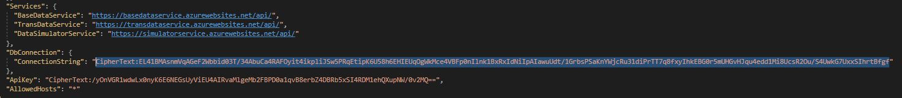

# Backend Overview
- **C#** (04.2022, https://docs.microsoft.com/de-de/dotnet/csharp/?WT.mc_id=dotnet-35129-website)
- **.NET 6.0** (04.2022, https://docs.microsoft.com/de-de/dotnet/)

## Frameworks
### Data Access
- Entity Framework Core (04.2022, https://docs.microsoft.com/en-us/ef/core/)
### Web Service
- ASP.NET (04.2022, https://dotnet.microsoft.com/en-us/apps/aspnet)
### Code Quality
#### Unit Tests
- xUnit (04.2022, https://xunit.net/)
#### Mocking 
- MOQ (04.2022, https://github.com/moq)
#### Code Coverage
- Coverlet (04.2022, https://github.com/coverlet-coverage/coverlet)
## Services
### Database
- Postgresql (https://www.postgresql.org/)
    - Instance: ElephantSQL (https://www.elephantsql.com/)
- Timescale (https://www.timescale.com/)
    - Instance: TimescaleCloud https://console.cloud.timescale.com/
### CI/CD
- CircleCi (https://app.circleci.com/pipelines/github/jku-win-se)
### Web Deployment
- Azure (https://azure.microsoft.com/de-de/)
    - Instances: 
        - BaseDataService: (https://basedataservice.azurewebsites.net/swagger/index.html)
        - TransDataService: (https://transdataservice.azurewebsites.net/swagger/index.html)
        - DataSimulatorService: (https://simulatorservice.azurewebsites.net/swagger/index.html)
## Architecture


## Installation for Backend-Execution
### Requirements
Be sure you have the following installed:
- Microsoft Visual Studio Community 2022 17.1.1 or higher with(https://visualstudio.microsoft.com/de/vs/community/)
- NET 6: (https://dotnet.microsoft.com/en-us/download/dotnet/6.0)
- State of the art browser (Google Chrome recommended)
- Local Git-Repository

Open the project:
- Open SLN-File *\teaching.ss22.prse.digitaltwin.team1\Backend\SmartRoom\SmartRoom.sln

For TransDataService you need:
- TimeScale DB-Connection on the internet

### Running the CSV import and export
- Check if BaseDataService is available: (https://basedataservice.azurewebsites.net/swagger/index.html)
- Excecute SmartRoom.CSVConsole after installing MS Visual Studio and importing sln-File
- follow the dialog for instance: 

Console-Dialog:
```
Import-File-Pfad angeben:
teaching.ss22.prse.digitaltwin.team1\Backend\SmartRoom\SmartRoom.CSVConsole\Data\
Folgende Files wurden im angegebenen Verzeichnis gefunden
```
After your input you get a list of all importable files at the given folder:
```
1: teaching.ss22.prse.digitaltwin.team1\Backend\SmartRoom\SmartRoom.CSVConsole\Data\Door.csv
2: teaching.ss22.prse.digitaltwin.team1\Backend\SmartRoom\SmartRoom.CSVConsole\Data\DoorOpen.csv
3: teaching.ss22.prse.digitaltwin.team1\Backend\SmartRoom\SmartRoom.CSVConsole\Data\Door_Connects_Room.csv
4: teaching.ss22.prse.digitaltwin.team1\Backend\SmartRoom\SmartRoom.CSVConsole\Data\PeopleInRoom.csv
5: teaching.ss22.prse.digitaltwin.team1\Backend\SmartRoom\SmartRoom.CSVConsole\Data\Room.csv
6: teaching.ss22.prse.digitaltwin.team1\Backend\SmartRoom\SmartRoom.CSVConsole\Data\Ventilator.csv
7: teaching.ss22.prse.digitaltwin.team1\Backend\SmartRoom\SmartRoom.CSVConsole\Data\VentilatorOn.csv
8: teaching.ss22.prse.digitaltwin.team1\Backend\SmartRoom\SmartRoom.CSVConsole\Data\Window.csv
9: teaching.ss22.prse.digitaltwin.team1\Backend\SmartRoom\SmartRoom.CSVConsole\Data\WindowOpen.csv
```
Now you can choose between (i)mport and (e)xport the base data (the exported files are located in the executing directory)
```
Was moechten Sie machen?  
i fuer Import  
e fuer Export
stop fuer beenden  
i  
Reading 3 lines from Door  
Reading 5 lines from DoorConnectsRoom  
Reading 6 lines from Room  
Reading 3 lines from Ventilator  
Reading 6 lines from Window  
Import beendet  
Was moechten Sie machen?  
i fuer Import  
e fuer Export  
stop fuer beenden 
```

### Running the backend
As mentioned above we use free azure ressources for backend hosting.
This ressources will be availiable till Oct. 31
The implementation of our CD keeps the services up to date on all commits to the main brunch.

Unfortunately our TimeScale-DB for the TransDataService is no longer availiable, so if you want to run the entire backend you need to configure a TimeScale-DB connection, the following section shows how to do this:

Replace the marked string with your connection string like this ("Host=serverName;Username=loginName;Password=password;Database=databasename"):



Run the follwoing command at: C:\Users\uvhs0mm\source\repos\teaching.ss22.prse.digitaltwin.team1\Backend\SmartRoom\SmartRoom.TransDataService
```
dotnet ef database update
```
This should apply the migrations on the database succesfully

After that you can push the changes to the main brunch and the service will get updated.

Now the backend should be available, you can test the services with the Swagger UI as follows:
- Open the service URL -> swagger should open (The SimulatorService takes a while to open at the first time. Sometimes you get a timeout, just wait a few minutes and open it again, this is because the service needs some time by generating the missing data)
- Input the API-Key at the authorize section and click authorize: bFR9bGhOi0n0ccoEhrhsE57VrHjkJJz9
- Now you can run the APIs for tests

Further information you can get from: markus.muehleder@gmail.com
