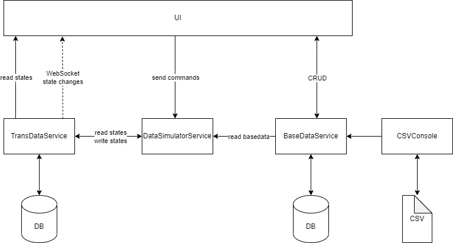

# Backend Overview
- **C#** (04.2022, https://docs.microsoft.com/de-de/dotnet/csharp/?WT.mc_id=dotnet-35129-website)
- **.NET 6.0** (04.2022, https://docs.microsoft.com/de-de/dotnet/)

## Frameworks
### Data Access
- Entity Framework Core (04.2022, https://docs.microsoft.com/en-us/ef/core/)
### Web Service
- ASP.NET (04.2022, https://dotnet.microsoft.com/en-us/apps/aspnet)
### Code Quality
#### Unit Tests
- xUnit (04.2022, https://xunit.net/)
#### Mocking 
- MOQ (04.2022, https://github.com/moq)
#### Code Coverage
- Coverlet (04.2022, https://github.com/coverlet-coverage/coverlet)
## Services
### Database
- Postgresql (https://www.postgresql.org/)
    - Instance: ElephantSQL (https://www.elephantsql.com/)
- Timescale (https://www.timescale.com/)
    - Instance: TimescaleCloud https://console.cloud.timescale.com/
### CI/CD
- CircleCi (https://app.circleci.com/pipelines/github/jku-win-se)
### Web Deployment
- Azure (https://azure.microsoft.com/de-de/)
    - Instances: 
        - BaseDataService: (https://basedataservice.azurewebsites.net/swagger/index.html)
        - TransDataService: (https://transdataservice.azurewebsites.net/swagger/index.html)
        - DataSimulatorService: (https://simulatorservice.azurewebsites.net/swagger/index.html)
## Architecture

## Installation for Backend-Execution
- Microsoft Visual Studio Community 2022 17.1.1 or higher with(https://visualstudio.microsoft.com/de/vs/community/)
    - ASP.NET und Webentwicklung
    - Azure-Entwicklung
    - Mobile-Entwicklung mit .NET
    - .NET-Desktopentwicklung
    - Entwicklung für die universelle Window-Plattform
    - Datenspeicherung und -verarbeitung
  
- Open SLN-File *\teaching.ss22.prse.digitaltwin.team1\Backend\SmartRoom\SmartRoom.sln

## Testing SmartRoom.CSVConsole
- Excecute SmartRoom.CSVConsole after installing MS Visual Studio and importing sln-File
- follow the dialog for instance: 

Console-Output:
Import-File-Pfad angeben:
teaching.ss22.prse.digitaltwin.team1\Backend\SmartRoom\SmartRoom.CSVConsole\Data\
Folgende Files wurden im angegebenen Verzeichnis gefunden

1: teaching.ss22.prse.digitaltwin.team1\Backend\SmartRoom\SmartRoom.CSVConsole\Data\Door.csv
2: teaching.ss22.prse.digitaltwin.team1\Backend\SmartRoom\SmartRoom.CSVConsole\Data\DoorOpen.csv
3: teaching.ss22.prse.digitaltwin.team1\Backend\SmartRoom\SmartRoom.CSVConsole\Data\Door_Connects_Room.csv
4: teaching.ss22.prse.digitaltwin.team1\Backend\SmartRoom\SmartRoom.CSVConsole\Data\PeopleInRoom.csv
5: teaching.ss22.prse.digitaltwin.team1\Backend\SmartRoom\SmartRoom.CSVConsole\Data\Room.csv
6: teaching.ss22.prse.digitaltwin.team1\Backend\SmartRoom\SmartRoom.CSVConsole\Data\Ventilator.csv
7: teaching.ss22.prse.digitaltwin.team1\Backend\SmartRoom\SmartRoom.CSVConsole\Data\VentilatorOn.csv
8: teaching.ss22.prse.digitaltwin.team1\Backend\SmartRoom\SmartRoom.CSVConsole\Data\Window.csv
9: teaching.ss22.prse.digitaltwin.team1\Backend\SmartRoom\SmartRoom.CSVConsole\Data\WindowOpen.csv

Was moechten Sie machen?  
i fuer Import  
e fuer Export
stop fuer beenden  
i  
Reading 3 lines from Door  
Reading 5 lines from DoorConnectsRoom  
Reading 6 lines from Room  
Reading 3 lines from Ventilator  
Reading 6 lines from Window  
Import beendet  
Was moechten Sie machen?  
i fuer Import  
e fuer Export  
stop fuer beenden  